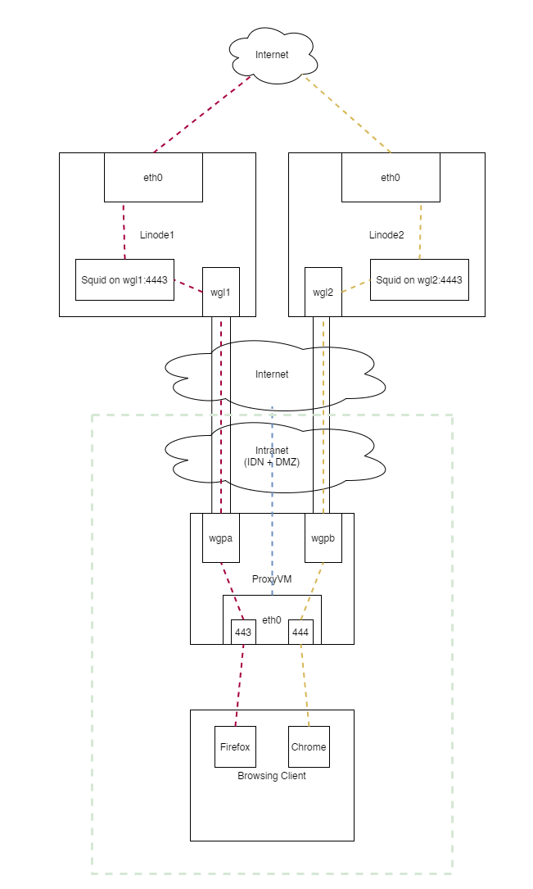

<link rel="stylesheet" type="text/css" href="css/github.css"> 

<h1 align="center"> 
  
</h1> 

## Distributed Denial of ID VPN

**Current Version:** 1.0  
**Last Update:** 04/24/22  
**Author:** awja  
**URL:** https://github.com/lleevveell66/DDoI-VPN  

Everyone needs their alter-egos...  

## Table of contents:

* [DDoI VPN](#distributed-denial-of-id-vpn) 
* [Table of Contents](#table-of-contents) 
* [Description](#description)
	* [Pros](#pros)
	* [Cons](#cons)
* [Theory of Operation](#theory-of-operation) 
	* [Hardware Components](#hardware-components)
	* [Software Components](#software-components)
	* [Usage and Network Flow](#usage-and-network-flow)
	* [Other Points](#other-points)
* [Requirements](#requirements)
* [Installation](#installation)
* [Best Practices](#best-practices)

## Description:

DDoI (pronounced, "duh doi") VPN is mostly intended to assist others in realizing their potential for taking 
complete control over their fake online (web-based) identities.  This is documented and tested
as an all-linux solution, though it could easily be changed for other OSes.  

Here are the main pros and cons of this solution over others:

### Pros:

* No third-party VPN service to trust
* No applications to install on the "Browsing Client"
* No network configuration required on the "Browsing Client"
* "Browsing Clients" can therefore be anything that has a web browser with proxy configuration capability (PC, Phone, Chromebook, tablet, etc.)
* Multiple, segregated browser instances can be open at once, allowing you to check email on fake ID #7, while still being logged into Facebook on Fake ID #18.

### Cons:

* Not as cheap as third-party services.  You are going to pay $5/mo per region you desire.
* Linode currently has limited regions.  This might be easily changed to work in AWS, however.
* The final egress is static for each region.  Linode offers no easy way to change IP addresses on an instance.

## Theory of Operation:

We will refer to the following diagram for this explaination:

<h1 align="center"> 
  
</h1> 

### Hardware Components:

DDoI VPN has 3 major hardware components, all of which are under your complete control at all times.  These are: the "Browsing Client", 
the "ProxyVM", and the "Linodes".  The ProxyVM might be better named something else, like "VPNrouter", "ProxyForwarder", or 
even just "Waypoint", but the name was chosen when the main purpose of the box was indeed to be purely a aimple proxy. 

The ProxyVM can be an internal machine.  All that is important is that it can reach the external Linode machines via UDP.  The 
choices for interface names is arbitrary and were chosen only to make the most sense in this diagram.  The choices for ports 
are also arbitrary.

This example only covers how to set DDoI up for two Linode instances, but you will see that it is easily expandable to as 
many as you can afford, essentially.

### Software Components:

There are two major software components to DDoI: WireGuard and Squid.  The rest is handled in this example through iptables, though
you are also free to use your favorite front-end.

WireGuard is a very fast VPN tunnel which will securely connect the ProxyVM to the Linodes.  Squid is a fairly robust proxy
software also freely avalable.  The Squid proxy runs on each Linode and is configured to listen to a port on the WireGuard
VPN tunnel, but use the Linode's external interface to browse the web.  There is nothing actually listening on the 
"proxy" ports on the ProxyVM.  All traffic coming into those ports are forwarded directly through the WireGuard VPN
tunnel to whichever Linode has been associated with it.  This is all done through iptables on the Proxy VPN.  There is no
special iptables trickery on the Linode end.  Squid takes care of proxying the traffic from the VPN tunnel to the outside.

### Usage and Network Flow:

The basic use and flow is:

* User creates a new blank profile for favorite browser and hardens it as much as possible.
* User configures this browser to use ProxyVM:443 as an HTTP proxy.
* User browses, and:
	* Web traffic exits Browsing Client and hits port 443 on ProxyVM.
	* iptables on ProxyVM forwards all traffic hitting port 443 on eth0 on ProxyVM to port 4443 on wgl1 on Linode1.
	* Squid on Linode1 is listening for traffic on wgl1:4443, and sees the traffic and verifies, if desired.
	* Squid proxies the web traffic out an ephermeral port on eth0 on Linode1.
	* Squid proxies the return traffic back through the WireGuard tunnel to the wgpa interface on ProxyVM.
	* iptables on ProxyVM then forwards the return web traffic back through port 443 on ProxyVM's eth0.
	* Return web traffic is handled by user's browser on Browsing client.

Very simple.  Very fast.

### Other Points:

There are many "best practices" to consider when setting this up for the first time, and we will cover many of them.  ALL web browsers, 
no matter how "secure" they claim to be, are contantly vomiting metadata.  This needs to be controlled.  This design also introduces a possible
pathway from the Internet and back through into your IDN.  This pathway must be tightly controlled.

But, once everything is up and going, there is nothing left to do but add another browser or profile that uses the other ProxyVM port, 
and you have a second fresh identity/footprint ready to be created.  A combination of browser brands, profiles, proxy switching 
extensions, and private+public browsing will give one the ability to come up with multiple web identities, the number limited only to 
your resources.  And, many of them can be up and worked at the same time!  Gone are the days of closing one browser down, making configuration
changes, and bringing a new one up, just to switch over to another online presense.

## Requirements:

The requirements for making this work are much fewer than making it work exactly like this example.  This example will be concentrated 
on here, though, and replacements for any part of this will be left to the reader.

The following things are required to precisely duplicate this design:

* A Redhat/CentOS/Rocky Linux machine on the local network, with access to the outside.  I use Rocky Linux 8.5 for everything, and the ProxyVM
is a virtual machine on my primary ESXi server.  A physical machine, docker container, or other virtualized solution should be fine.  
The proceudre is tweaked for Rocky Linux, though.   <a href="https://rockylinux.org/download/">Rocky Linux</a> is 100% bug-for-bug compatible 
with RedHat Enterprise Linux, started by one of the originl CentOS founders.  It is what CentOS would have become had they not gone the way
they did.
* Two or more <a href="https://www.linode.com/">Linode</a> "nanodes" or better.  The cheapest 1GB Nanode with shared CPU is fine for this.  
They were $5/mo per instance at the time of this writing.  Check the options to see what might work best for you.  I am not using mine to watch 
tons of movies or trade warez, so the 1TB data cap is fine, so far.  
* Both of my Linodes also have Rocky Linux 8.x images installed.
* It makes the most sense for this if these instances are not near your own region.  But, you can do it however you like.  I have tested 
Singapore from where I am (far away from Singapore) and speeds are fine, except sometimes in the middle of their afternoons.  I tend to
build fake international identities, though.
* This solution will use the <a href="https://www.wireguard.com/">WireGuard</a> VPN tunnel.
* This solution will use the <a href="http://www.squid-cache.org/">Squid</a> caching proxy.
* This solution will utilize the <a href="https://www.netfilter.org/projects/iptables/index.html">iptables</a> userspace command line program.
You can use whatever you are comfortable with, but I will show you how to tear firewalld out and put iptables back into place on a RedHat 
variant OS.
* This example will use the <a href="https://www.mozilla.org/en-US/firefox/new/">Firefox</a> browser on a Windows 10 machine.  Everything you
learn here about how to get Firefox going should carry over to all of the "secure" packaged variants, like Tor browser.  Chrome will also
be covered a little, which should open up its variants (Brave, Epic, et al) for you to explore as well.

## Installation:

This is how it's installed

more to come...

## Best Practices:

List some best practices for a successful fake online presense, here.

more to come....

